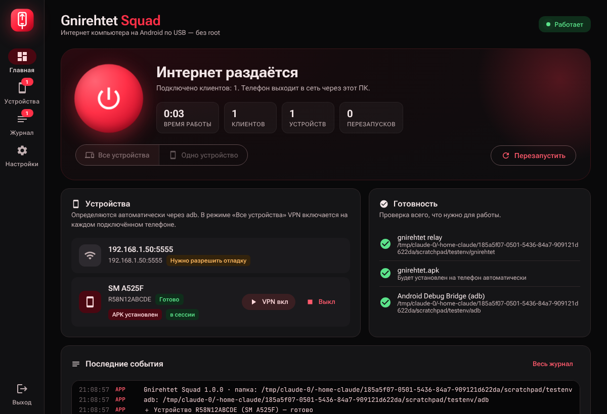
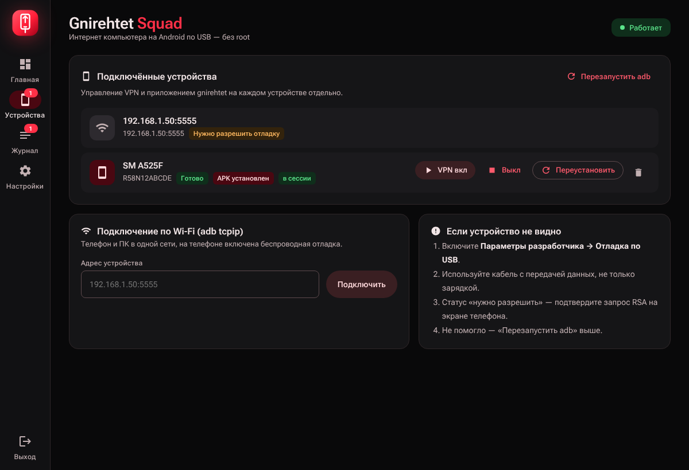
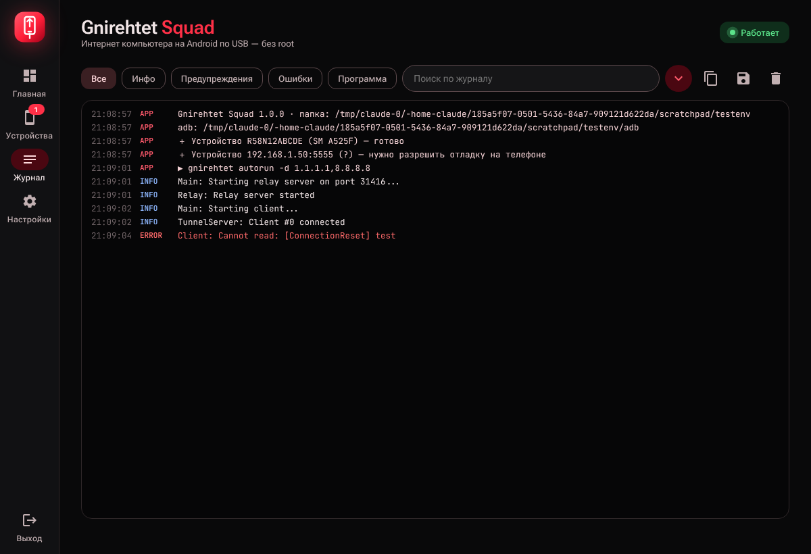
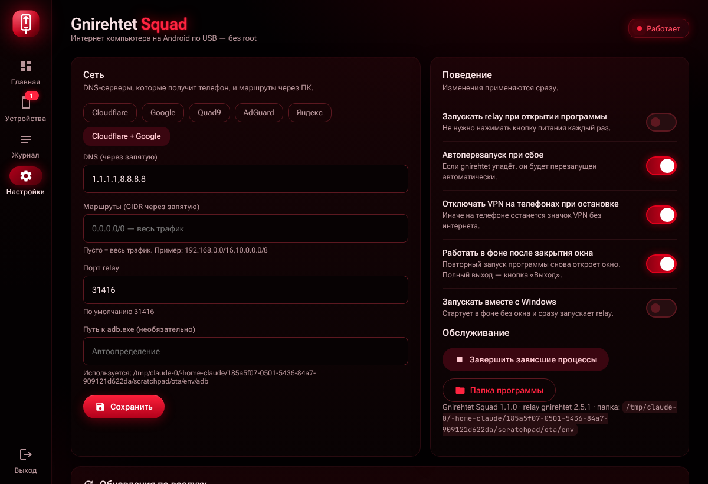

# Gnirehtet Squad

Графическая оболочка для [gnirehtet](https://github.com/Genymobile/gnirehtet) 2.5.1 под Windows: раздаёт интернет компьютера на Android-телефон по USB (reverse tethering), root не нужен.

Интерфейс в стиле Material Design 3: тёмная тема, алые акценты на чёрном.



## Быстрый старт

1. Скачайте архив `GnirehtetSquad-*-win64.zip` из [Releases](../../releases) и распакуйте папку целиком.
2. На телефоне включите «Параметры разработчика → Отладка по USB», подключите кабель.
3. Запустите `GnirehtetSquad.exe`.
4. Если adb не найден, нажмите «Скачать platform-tools» (официальный архив Google).
5. Нажмите красную кнопку питания и подтвердите запрос VPN на телефоне.

## Возможности

- Старт, стоп и перезапуск relay одной кнопкой; режимы «Все устройства» (`autorun`) и «Одно устройство» (`run <serial>`).
- Список устройств с моделью и статусом; включение и выключение VPN, установка, переустановка и удаление APK на каждом телефоне.
- Подключение по Wi-Fi (`adb connect`), перезапуск adb-сервера.
- Живой журнал: фильтры по уровню, поиск, копирование, сохранение в файл.
- Время работы, число подключённых клиентов, счётчик перезапусков.
- Автоперезапуск relay при падении.
- Настройки DNS с пресетами (Cloudflare, Google, Quad9, AdGuard, Яндекс), маршруты, порт, путь к adb.
- Выключение VPN на телефонах при остановке, чтобы не оставался «мёртвый» значок VPN.
- Проверка занятого порта и кнопка «Завершить зависшие процессы».
- Работа в фоне после закрытия окна и автозагрузка вместе с Windows (`--background`).
- Один экземпляр: повторный запуск открывает окно уже работающей программы.

| Устройства | Журнал | Настройки |
|---|---|---|
|  |  |  |

## Как устроено

Один исполняемый файл на Go без внешних зависимостей. Внутри: HTTP-сервер на `127.0.0.1:47316` (REST + Server-Sent Events) и встроенный интерфейс `app/ui/index.html`. Окно открывается через Microsoft Edge (есть в Windows 10/11) в режиме приложения `--app=`, запасные варианты: Chrome, Brave, браузер по умолчанию. Оболочка запускает `gnirehtet.exe` и `adb.exe` как дочерние процессы без консольных окон и разбирает их вывод.

Поиск adb по порядку: путь из настроек, `platform-tools\` рядом с программой, `adb.exe` рядом с программой, `%APPDATA%\GnirehtetSquad\platform-tools\`, `PATH`, `ANDROID_HOME` / `ANDROID_SDK_ROOT`, `%LOCALAPPDATA%\Android\Sdk`.

Настройки хранятся в `%APPDATA%\GnirehtetSquad\settings.json`.

```
app/                Go-исходники оболочки
  main.go           сервер, управление relay, устройства, журнал
  platform_*.go     Windows-специфика: скрытые процессы, окно, автозагрузка
  ui/               интерфейс (HTML/CSS/JS, вшивается в exe)
  winres/           иконка и манифест; rsrc_windows_amd64.syso собран из них
bin/                оригинальные gnirehtet.exe / gnirehtet.apk 2.5.1 (Apache 2.0)
docs/               README для архива и скриншоты
```

## Сборка

Нужен Go 1.22+.

```bash
./build.sh 1.0.0        # Linux/macOS: кросс-сборка, результат в dist/
```

```bat
build.cmd               :: Windows
```

Иконку можно пересобрать так: `go install github.com/akavel/rsrc@latest && rsrc -ico app/winres/icon.ico -manifest app/winres/app.manifest -arch amd64 -o app/rsrc_windows_amd64.syso`.

GitHub Actions собирает архив на каждый push (артефакт в Actions). Релизы выпускаются автоматически: достаточно поднять `appVersion` в `app/main.go` и запушить в `main` — workflow сам создаст тег `vX.Y.Z` и релиз с zip.

## Лицензии

gnirehtet © Genymobile, Apache License 2.0 (см. `bin/NOTICE.md`).
